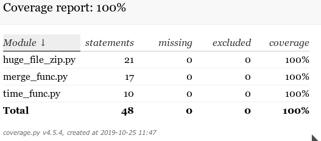

# Headers

This repository contains solving three tasks:
- **[Time-string parser](/time_func.py)**
- **[File-zipper](/huge_file_zip.py)**
- **[Generator merge](/merge_func.py)**
     
## Install

```bash
pip install -r requirements.txt
```

## For tests running

simple test run
```bash
~ $ pytest   
```
test run with html-coverage report
```bash
~ $ pytest --cov  
```

##  Test coverage report




